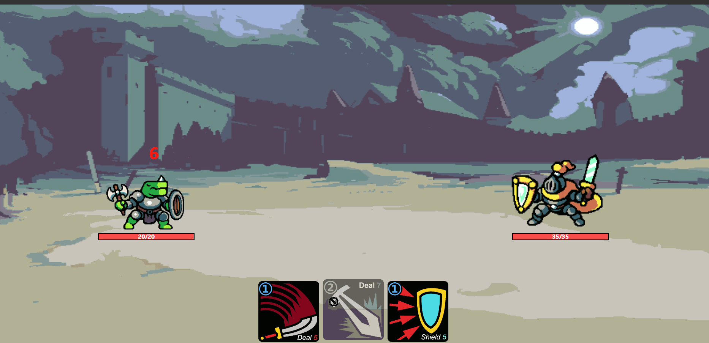

# Slay the King

**_BEWARE:_ This client was published for learning purposes. It is _not_ intended for use in production-grade software.**

Slay the King is a turn-based combat game where the player faces off against a powerful King in a card based battle. The goal of the game is to defeat the King and restore peace to the kingdom.

## Gameplay

### Character Selection

At the beginning of the game, players can choose one of the available characters. Each character has unique abilities and a different set of cards.


### Combat Mechanics

Players engage in turn-based combat against enemy. During their turn, players can use cards to attack, defend, or use special. The enemy will also take a turn to attack the player. The goal is to reduce the enemy's health to zero while keeping the player's character alive.



### Cards

Cards have effects in battle, such as dealing damage and increasing the player's defense. Cards have a cooldown period and cannot be used in the same turn.

## Getting Started

Follow the instructions below to set up the project on your local machine, and also need to run the server on the another terminal

### Prerequisites

Before you begin, ensure you have the following software installed on your computer:

- Node.js (v12.x or higher)
- npm (v6.x or higher)

## Setup Instructions

1. Clone repository onto your local machine. 

```bash
git clone https://github.com/jayrmesa/slay-the-king.git
```

Run the following command in both the root and server directory to install all dependancies.

```bash
npm i
```
2. Create a .env file in the root of the server following the example of the .env.local.example as a template.

3. Reset local database in server directory:

```bash
npm run db:reset
```
4. Run the express server in the server directory:

```bash
npm run start
```

5. Run the webpack server in the root directory:

```bash
npm run start
```

## Dependencies
### Root folder
- react: 17.0.2
- react-dom: 17.0.2
- react-router-dom: 5.3.0
- react-scripts: 4.0.3
- web-vitals: 1.1.2

#### Server folder
- express: 4.17.1
- socket.io: 4.4.1
- axios: "^1.3.5"
- cors: "^2.8.5"
- dotenv: "^16.0.3"
- morgan: "~1.9.1",
- pg: "^8.10.0"

## Authored By
### Arnold Mesa JayR 